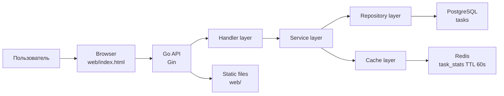
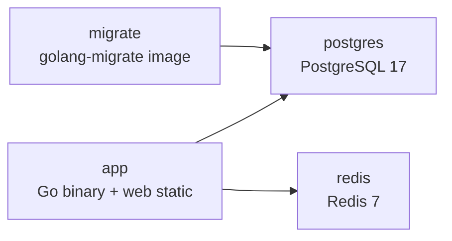

# Архитектура GoTaskFlow

## Назначение системы

GoTaskFlow - простое веб-приложение и API для управления задачами. Система позволяет создать задачу, посмотреть список задач, изменить статус, удалить задачу и получить агрегированную статистику.

## Компоненты



## Backend

Backend написан на Go с использованием Gin.

Основные слои:

- `handler` - HTTP handlers и маршруты;
- `service` - бизнес-логика, валидация, сброс Redis-кэша;
- `repository` - работа с PostgreSQL и тестовый in-memory repository;
- `cache` - Redis-кэш статистики;
- `model` - доменные структуры `Task`, `TaskStatus`, `TaskStats`;
- `config` - чтение переменных окружения.

## Хранилище данных

PostgreSQL хранит задачи в таблице `tasks`:

```sql
CREATE TABLE tasks (
    id SERIAL PRIMARY KEY,
    title VARCHAR(255) NOT NULL,
    description TEXT,
    status VARCHAR(50) NOT NULL DEFAULT 'todo',
    created_at TIMESTAMP NOT NULL DEFAULT NOW(),
    updated_at TIMESTAMP NOT NULL DEFAULT NOW()
);
```

Redis используется для кэширования статистики `/api/stats` на 60 секунд. При создании, удалении или изменении статуса задачи кэш сбрасывается.

## API

| Метод | Endpoint | Назначение |
|---|---|---|
| GET | `/health` | Проверка работоспособности API |
| GET | `/api/tasks` | Получить список задач |
| POST | `/api/tasks` | Создать задачу |
| GET | `/api/tasks/{id}` | Получить задачу по ID |
| PATCH | `/api/tasks/{id}/status` | Изменить статус задачи |
| DELETE | `/api/tasks/{id}` | Удалить задачу |
| GET | `/api/stats` | Получить статистику задач |

## Контейнерная архитектура



Docker Compose поднимает:

- `app` - приложение GoTaskFlow;
- `postgres` - база данных;
- `redis` - кэш;
- `migrate` - одноразовый сервис для применения SQL-миграций.

## CI/CD

GitHub Actions pipeline выполняет:

- checkout кода;
- setup Go;
- загрузку зависимостей;
- `gofmt` check;
- `go vet ./...`;
- `go test ./...`;
- security scan через `gosec`;
- сборку приложения.

В дальнейшем pipeline можно расширить этапами:

- build Docker image;
- push image в Docker Hub или GHCR;
- deploy на VPS или в облачный container service.
