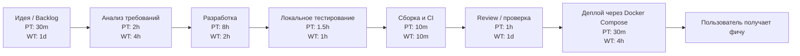
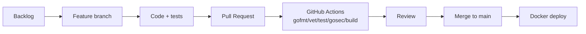

# Value Stream Mapping AS-IS

## Контекст

Анализ выполнен для проекта GoTaskFlow - учебного task tracker на Go. Рассматривается путь одной фичи от идеи до доступности пользователю в веб-интерфейсе и API.

Фича-пример: добавление Redis-кэширования для endpoint `GET /api/stats`.

## VSM-карта

## Этапы потока

| Этап | Описание | PT | WT |
|---|---|---:|---:|
| Идея / Backlog | Формулирование задачи, определение ожидаемого результата | 30 минут | 1 день |
| Анализ требований | Уточнение API, структуры данных, влияния на PostgreSQL и Redis | 2 часа | 4 часа |
| Разработка | Реализация модели, service-логики, repository/cache-слоя, frontend или API | 8 часов | 2 часа |
| Локальное тестирование | Запуск `go test`, ручная проверка API, проверка Docker Compose | 1.5 часа | 1 час |
| Сборка и CI | `gofmt`, `go vet`, `go test`, `gosec`, `go build` | 10 минут | 10 минут |
| Review / проверка | Самопроверка, оформление README, подготовка коммита/PR | 1 час | 1 день |
| Деплой | Сборка Docker-образа, запуск PostgreSQL/Redis/app, проверка healthcheck | 30 минут | 4 часа |

## Расчет времени

Processing Time:

- 30m + 2h + 8h + 1.5h + 10m + 1h + 30m = примерно 13 часов 40 минут.

Wait Time:

- 1d + 4h + 2h + 1h + 10m + 1d + 4h = примерно 2 дня 11 часов.

Оценочный Lead Time:

- около 3 рабочих дней с учетом ожидания проверки, переключения контекста и ручной подготовки окружения.

## Узкие места

### 1. Review / проверка

Причина: изменения проверяются вручную, есть ожидание обратной связи, требуется сверка требований задания, документации и кода.

Влияние:

- фича уже готова технически, но не попадает в `main`;
- растет Lead Time;
- увеличивается риск конфликтов при долгом ожидании.

Улучшения:

- маленькие Pull Request;
- чеклист review;
- обязательный CI перед review;
- шаблон описания PR.

### 2. Деплой и подготовка окружения

Причина: приложение зависит от PostgreSQL, Redis, миграций и корректных переменных окружения. Без Docker Compose ручная настройка занимает много времени.

Влияние:

- высокая вероятность ошибки окружения;
- сложно воспроизвести проблему;
- деплой зависит от локальной машины.

Улучшения:

- Docker Compose для локального и учебного запуска;
- healthcheck для PostgreSQL и Redis;
- автоматический запуск миграций;
- единый `.env.example`.

## Целевое улучшение TO-BE

После внедрения CI/CD и Docker Compose целевой поток должен выглядеть так:

Ожидаемое улучшение:

- сократить ручную проверку за счет автоматических тестов;
- сократить ожидание деплоя за счет контейнеризации;
- уменьшить количество ошибок окружения.
