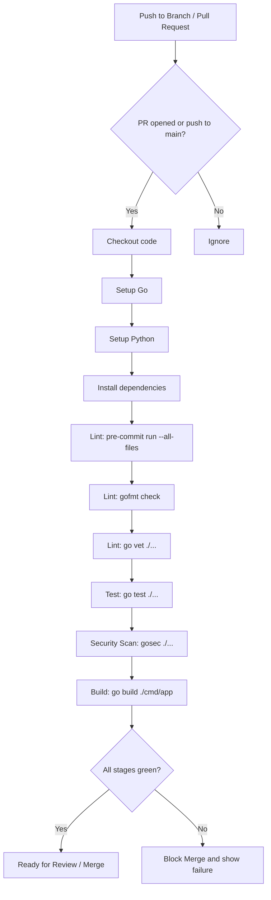

# Логика CI Pipeline

## Назначение

CI pipeline нужен для быстрой обратной связи по каждому изменению. Он дублирует локальные проверки pre-commit и гарантирует, что в `main` не попадет код без форматирования, тестов и базовой security-проверки.

## Триггеры

Pipeline запускается при:

- `push` в ветки `main` и `master`;
- создании или обновлении Pull Request.

## Mermaid-схема

## Этапы pipeline

| Stage | Команда | Назначение |
|---|---|---|
| Checkout | `actions/checkout@v4` | Получить код из репозитория |
| Setup Go | `actions/setup-go@v5` | Установить версию Go из `go.mod` |
| Setup Python | `actions/setup-python@v5` | Подготовить Python для `pre-commit` |
| Install dependencies | `go mod download` | Загрузить зависимости Go |
| Lint | `pre-commit run --all-files` | Запустить локальные хуки на сервере |
| Lint | `gofmt -l .` | Проверить форматирование Go-кода |
| Lint | `go vet ./...` | Выполнить статический анализ Go |
| Test | `go test ./...` | Запустить unit-тесты |
| Security Scan | `gosec ./...` | Найти потенциальные security-проблемы |
| Build | `go build -buildvcs=false -v ./cmd/app` | Проверить сборку приложения |

## Почему это Fast Feedback Loop

Разработчик получает обратную связь дважды:

1. Локально до коммита через `pre-commit`.
2. В GitHub после push/PR через GitHub Actions.

Это снижает вероятность попадания в PR кода с плохим форматированием, падающими тестами или базовыми security-проблемами.

## Поведение при ошибке

Если падает любой этап pipeline:

- Pull Request получает красный статус;
- merge в `main` блокируется branch protection rule;
- автор PR видит конкретный упавший шаг в GitHub Actions;
- исправление делается в той же ветке и pipeline запускается повторно.
